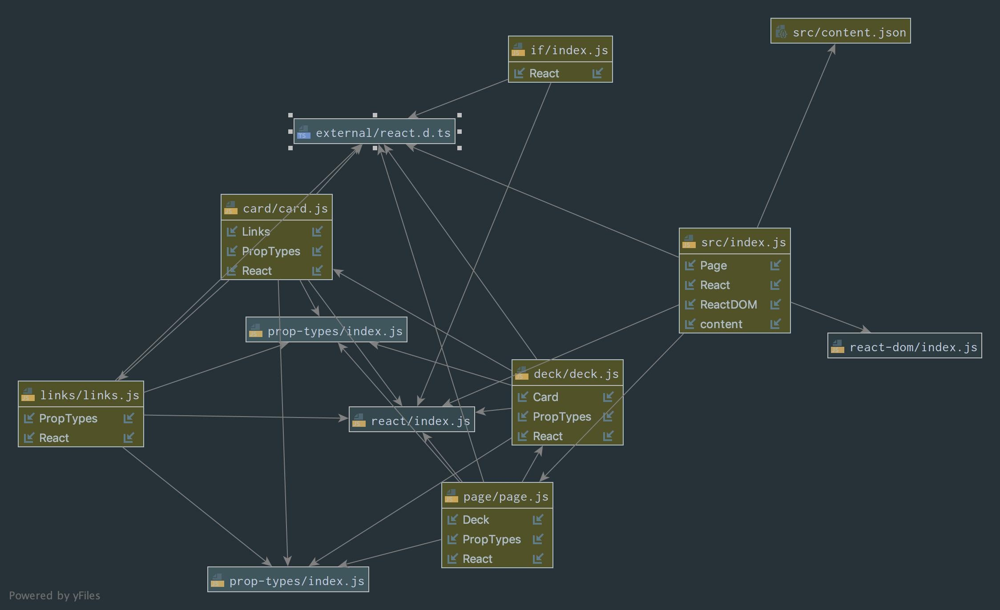

# LAB - 29 A

## Component Composition

### Author: Eric Huang

### Links and Resources
* [submission PR](https://github.com/erichuang-401-advanced-javascript/401-lab-29-practice/pull/2)
* [travis](https://travis-ci.org/erichuang-401-advanced-javascript/401-lab-29-practice)

#### UML

